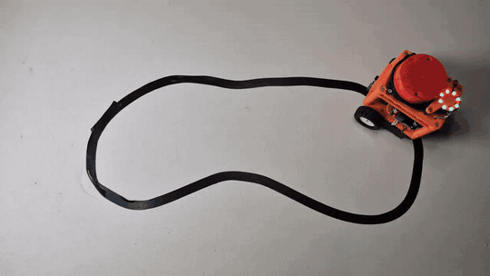

## ROSiK на чёрной линии — видео

GIF записан на реальном роботе. Текущая версия: [ROSiK_Line_Follower_v4.ino](ROSiK_Line_Follower_v4.ino) — калибровка в NVS, старт/стоп по кнопке, увеличенное время поиска линии и усиленная коррекция.

# ROSiK — движение по чёрной линии (NVS + кнопка)

В этой версии сохранён алгоритм следования по правому краю чёрной линии с одним аналоговым датчиком на **GPIO39**.

## Калибровка

1. Положите датчик на **белое** поле и отправьте `w` в Serial Monitor (115200 бод).
2. Положите на **чёрное** поле и отправьте `b`.
3. Если контраст достаточный, пара WHITE/BLACK автоматически сохранится в энергонезависимой памяти ESP32 (**NVS**). После отключения питания повторная калибровка не нужна.
4. Включите робота, установите датчик над правой границей чёрной линии (чёрное — слева).
5. Нажмите **кнопку GPIO25** для старта; повторное нажатие — стоп.

Кнопка подключается к **GPIO25 и GND**, в коде `INPUT_PULLUP`. Работает антидребезг 45 мс. Также сохранены команды `g` (старт) и `s` (стоп).

**Важно:** новое значение одного цвета не перезаписывает ранее сохранённую пару: для сохранения нужно измерить **оба** цвета в текущем запуске. Без валидной калибровки старт запрещён. При сбое датчика/энкодеров работают прежние механизмы остановки.

## Зависимости

ESP32 (классическая плата), FastLED и `driver/pcnt.h` (как в предыдущей версии). Перед поездкой проверьте на подставке направление вращения колёс. В прошивке не менялись скорость, коэффициент поворота и логика следования по линии из v2.

## Версия v4 — резкие повороты

[Скетч ROSiK_Line_Follower_v4.ino](ROSiK_Line_Follower_v4.ino) — развитие v3 с сохранением калибровки в NVS и кнопкой GPIO25.

| Параметр | v3 | v4 |
| --- | ---: | ---: |
| `LOST_TIMEOUT` | 1700 мс | 3500 мс |
| `STEER_KP` | 55 | 75 |
| `MAX_STEER` | 23 мм/с | 30 мм/с |
| `MAX_STEER_RATE` | 110 | 155 мм/с² |

Основная скорость 48 мм/с, управление кнопкой, калибровка и защита энкодеров сохранены. Если датчик видит только чёрное или только белое более 3,5 с, робот по-прежнему останавливается. Калибровка при обновлении прошивки сохраняется в NVS, если память не очищать.
