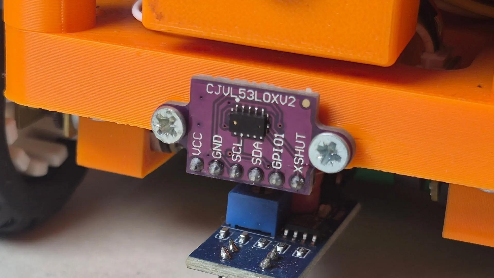
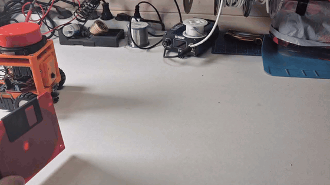
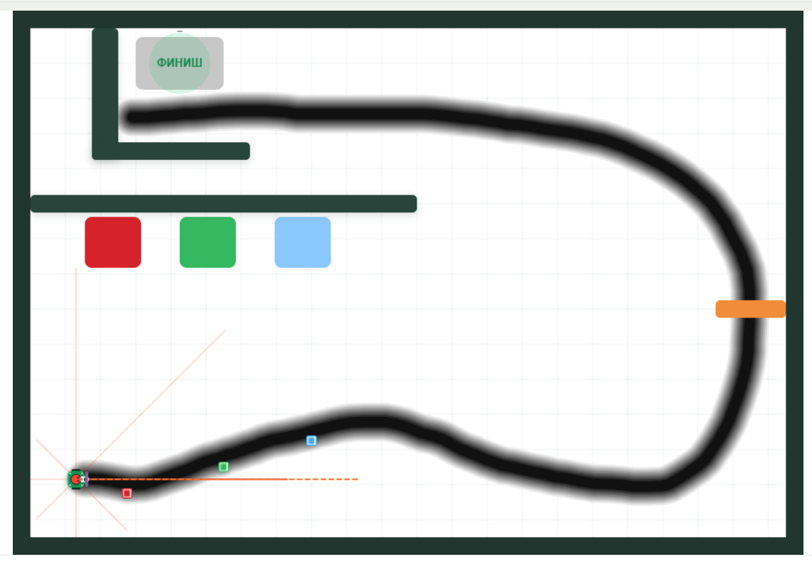

# VL53L0X — лазерный дальномер + ESP32

Практические скетчи для измерения расстояния **в миллиметрах**, подключения двух модулей на одну шину I²C, калибровки и автономного движения робота **ROSiK**.

> **Важно:** VL53L0X — оптический ToF-датчик, а не механический дальномер. Точность зависит от поверхности цели, освещения, расстояния и конкретного экземпляра. Калибровка рекомендуется для точных задач, но не гарантирует ±3 мм во всём диапазоне.

## Фото и визуальные материалы

### Дальномер VL53L0X

### ROSiK в движении

### Виртуальная лаборатория ROSiK

Попробовать алгоритмы можно прямо в браузере:

- [ROSiK Lab — виртуальная лаборатория](https://rosikbot.ru/lab/)
- [ROSiK — сайт проекта](https://rosikbot.ru/)

Скриншот симулятора:

## Примеры

| Пример | Что делает |
| --- | --- |
| [01 · Один VL53L0X](01_Single_Sensor/01_Single_Sensor.ino) | Показания расстояния, проверка ошибок |
| [02 · Два VL53L0X](02_Dual_Sensor/02_Dual_Sensor.ino) | Независимые измерения, XSHUT, адреса 0x30 и 0x29 |
| [03 · Калибровка](03_Calibration/03_Calibration.ino) | RAW и CORR, линейная поправка |
| [04 · ROSiK следует за объектом](04_ROSiK_Follow/04_ROSiK_Follow.ino) | Движение к цели, стоп на 70 мм, правый поворот через 3 с |

## Подключение

ESP32 (классический DevKit): **SDA → GPIO21**, **SCL → GPIO22**, общий **GND**. Питание **VIN/VCC** выбирайте по спецификации именно вашего модуля: у разных плат VL53L0X отличаются стабилизатор и преобразователи уровней. Не подавайте 5 В напрямую на линии ESP32.

Для двух датчиков: линии SDA и SCL — **общие**. Дополнительно подключите **XSHUT левого → GPIO19**, **XSHUT правого → GPIO18**. Проверьте, что XSHUT подтянут к допустимому для ESP32 напряжению (не к 5 В). Датчики по умолчанию имеют **одинаковый адрес 0x29**; оба сразу не могут работать как независимые устройства на одном I²C-адресе. Код удерживает оба в сбросе, запускает левый, меняет его адрес на `0x30`, затем запускает правый на `0x29`. **После отключения питания адреса сбрасываются**, поэтому присвоение выполняется при каждом старте. На модулях без доступного XSHUT понадобится иная схема изоляции/мультиплексор I²C.

## Запуск

1. Установите **Arduino IDE**, поддержку платы **ESP32** и библиотеку **VL53L0X by Pololu** (нужны также `Wire` и, для ROSiK, зависимости штатной прошивки).
2. Откройте соответствующую папку проекта и `.ino` с таким же названием.
3. Укажите корректную ESP32 и порт, загрузите скетч. Откройте **Serial Monitor 115200 бод**.
4. Для двух датчиков вначале убедитесь, что подключены оба XSHUT; посмотрите сообщения `LEFT` / `RIGHT`.
5. Для ROSiK сначала можно проверить идею движения в [ROSiK Lab](https://rosikbot.ru/lab/), а затем переносить алгоритм на реальный робот.

## Калибровка по двум точкам

1. Установите плоскую неподвижную мишень, измерьте линейкой две реальные дистанции `REF1` и `REF2` (например, **60** и **200 мм**). Учитывайте физическую точку отсчёта.
2. Для каждой позиции снимите **10–20 RAW-замеров**, усредните, получите `RAW1` и `RAW2`.
3. Вычислите `G = (REF2 - REF1) / (RAW2 - RAW1)` и `O = REF1 - G × RAW1`. При `RAW2 == RAW1` калибровка невозможна.
4. Подставьте `G` и `O` в скетч, сравните `CORR` с линейкой на **третьей дистанции**, не использованной для расчёта. Повторите при необходимости.

**Проверка арифметики:** если 60 мм → RAW 90 мм и 200 мм → RAW 250 мм, то `G = 140 / 160 = 0.875`, `O = 60 − 0.875 × 90 = −18.75`. Числа `0.969` и `−37.21` в примере — **независимые константы конкретного ROSiK**, их не следует переносить на все датчики без измерений.

## ROSiK — алгоритм

- **Больше 78 мм:** едет вперёд; обе половины кольца **зелёные**.
- **78 мм и ближе:** останавливается; кольцо **красное**; через **3 секунды** непрерывной остановки перед препятствием начинает поворачивать **направо**.
- **Поворот:** мигают **светодиоды 4–7 правой стороны** жёлтым (исправлена обратная индикация), поворот ориентировочно на 90° по одометрии.
- **Нет валидного измерения:** остановка, красная индикация; таймер сбрасывается.

Дистанция 70 мм — уставка, 8 мм — зона допуска для остановки. Колёса и датчик имеют инерцию; испытания начинайте с приподнятыми колёсами. Физическая ориентация кольца при иной сборке может отличаться.

**Внимание:** `04_ROSiK_Follow` — полная специализированная прошивка на основе исходного `full_firmware.ino`; использует PID, энкодеры и связанные библиотеки. Это не скетч для голой платы ESP32 без компонентов ROSiK. Не проверено на реальном оборудовании в рамках подготовки репозитория.

## Ссылки

- [РоботИКС](https://robotx.su/)
- [ROSiK](https://rosikbot.ru/)
- [ROSiK Lab — виртуальная лаборатория](https://rosikbot.ru/lab/)
- [Лаборатория GitHub](https://github.com/stepanburmistrov/lab)
- [Библиотека Pololu VL53L0X](https://github.com/pololu/vl53l0x-arduino)

Код распространяется по [MIT License](../../LICENSE).
