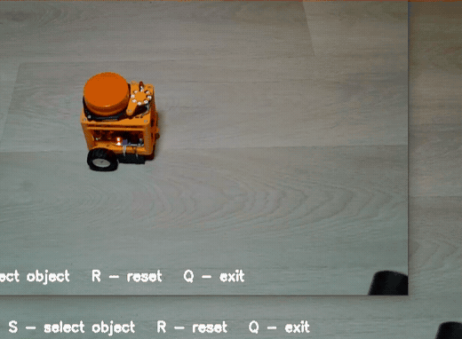

# CSRT Tracker — отслеживание выбранного объекта в OpenCV

Пример трекинга объекта с веб-камеры при помощи **CSRT Tracker** из OpenCV.

В любой момент можете выбрать объект мышью, после чего программа старается находить этот же объект на каждом новом кадре, рисует вокруг него рамку и показывает координаты центра.



## Что умеет пример

- получать изображение с веб-камеры;
- выбирать произвольный объект прямо во время работы программы;
- запускать CSRT-трекер для выбранной области;
- отслеживать перемещение объекта в следующих кадрах;
- рисовать рамку вокруг найденного объекта;
- вычислять и показывать координаты его центра;
- сообщать о потере объекта;
- сбрасывать трекер и выбирать новый объект без перезапуска программы.

## Управление

| Клавиша | Действие |
|---|---|
| `S` | выбрать объект мышью и запустить трекинг |
| `R` | сбросить текущий трекер |
| `Q` | выйти из программы |
| `Esc` | выйти из программы |

После нажатия `S` нужно выделить объект мышью и подтвердить выбор в окне OpenCV.

---

# Что такое CSRT

**CSRT** — это один из классических трекеров OpenCV. Название расшифровывается как **Discriminative Correlation Filter with Channel and Spatial Reliability**.

В отличие от детектора объектов, трекер не пытается каждый кадр заново ответить на вопрос «что находится на изображении?». Вместо этого он получает объект один раз — в виде прямоугольной области — и дальше ищет наиболее похожее положение этого объекта на следующих кадрах.

Схема работы здесь такая:

```text
кадр с камеры
      ↓
пользователь выбирает объект
      ↓
tracker.init(frame, box)
      ↓
новый кадр
      ↓
tracker.update(frame)
      ↓
новое положение объекта
      ↓
рамка + координаты центра
```

## Почему CSRT хорош

CSRT обычно хорошо справляется с ситуациями, когда объект:

- перемещается по кадру;
- немного поворачивается;
- меняет масштаб;
- частично меняется из-за освещения;
- движется на неидеальном фоне.

При этом CSRT достаточно прост в использовании: для запуска ему нужен только текущий кадр и прямоугольник вокруг объекта.

---

# Установка

Нужен Python и версия OpenCV, в которой доступны дополнительные алгоритмы трекинга.

```bash
pip install opencv-contrib-python
```

Запуск:

```bash
python CSRT_Tracker.py
```

Программа открывает камеру с индексом `0`:

```python
camera = cv2.VideoCapture(0)
```

Если в системе несколько камер, индекс можно изменить на `1`, `2` и т.д.

---

# Разбор кода

## 1. Создание CSRT-трекера

```python
def create_tracker():
    if hasattr(cv2, "TrackerCSRT_create"):
        return cv2.TrackerCSRT_create()

    if hasattr(cv2, "legacy"):
        return cv2.legacy.TrackerCSRT_create()

    raise RuntimeError(
        "CSRT-трекер не найден.\n"
        "Установите: pip install opencv-contrib-python"
    )
```

В разных версиях OpenCV API трекеров располагается немного по-разному.

В одних версиях CSRT создаётся так:

```python
cv2.TrackerCSRT_create()
```

В других находится в пространстве `legacy`:

```python
cv2.legacy.TrackerCSRT_create()
```

Поэтому функция сначала проверяет первый вариант, затем второй.

Это делает пример более совместимым с разными установками OpenCV.

---

## 2. Открытие камеры

```python
camera = cv2.VideoCapture(0)
```

`VideoCapture(0)` открывает основную веб-камеру компьютера.

Дальше создаётся переменная:

```python
tracker = None
```

`None` означает, что объект пока не выбран и активного трекера нет.

---

## 3. Основной цикл программы

```python
while True:
    ok, frame = camera.read()

    if not ok:
        break
```

`camera.read()` возвращает два значения:

- `ok` — удалось ли получить кадр;
- `frame` — само изображение.

Если кадр получить не удалось, программа выходит из цикла.

---

## 4. Обновление положения объекта

Главная строка всего примера:

```python
found, box = tracker.update(frame)
```

Она вызывается для каждого нового кадра, если трекер уже был создан.

CSRT анализирует изображение и возвращает:

- `found` — удалось ли найти объект;
- `box` — новое положение прямоугольной области объекта.

`box` содержит четыре значения:

```text
x, y, width, height
```

или сокращённо:

```text
x, y, w, h
```

Здесь `x` и `y` — координаты левого верхнего угла рамки.

---

## 5. Преобразование координат

```python
x, y, w, h = map(int, box)
```

Трекер может вернуть координаты как числа с плавающей точкой.

Для рисования средствами OpenCV удобнее использовать целые числа, поэтому значения преобразуются через `int`.

---

## 6. Рамка вокруг объекта

```python
cv2.rectangle(
    frame,
    (x, y),
    (x + w, y + h),
    (0, 255, 0),
    2
)
```

Для прямоугольника нужны две точки:

```text
(x, y)            ────────┐
                          │
                          │
                    └─────(x+w, y+h)
```

Цвет `(0, 255, 0)` в OpenCV означает зелёный, потому что OpenCV использует порядок каналов **BGR**, а не RGB.

---

## 7. Вычисление центра объекта

```python
cx = x + w // 2
cy = y + h // 2
```

Центр прямоугольника находится очень просто:

```text
cx = x + width / 2
cy = y + height / 2
```

В программе используется целочисленное деление `//`, потому что координаты пикселей нужны целыми.

Затем центр отмечается красной точкой:

```python
cv2.circle(frame, (cx, cy), 5, (0, 0, 255), -1)
```

И выводится текстом:

```python
cv2.putText(
    frame,
    f"Center: {cx}, {cy}",
    ...
)
```

Координаты центра особенно полезны дальше в робототехнике. Например, по ним можно понять, находится объект левее или правее центра камеры и сформировать управляющую команду для поворота робота.

---

## 8. Что происходит, если объект потерян

```python
if found:
    ...
else:
    cv2.putText(
        frame,
        "Object lost",
        ...
    )
```

Если трекер больше не может уверенно определить положение объекта, `update()` возвращает `found = False`.

В таком случае программа выводит сообщение `Object lost`.

Важно понимать: CSRT — это не полноценный детектор объектов. Если объект полностью исчез из кадра, а потом снова появился, трекер не обязан найти его заново. Для такого поведения обычно объединяют **детектор + трекер**.

---

## 9. Выбор объекта во время работы

При нажатии `S` вызывается:

```python
box = cv2.selectROI(
    "Select object",
    frame,
    fromCenter=False,
    showCrosshair=True
)
```

`selectROI()` временно открывает окно, где можно мышью нарисовать прямоугольник вокруг нужного объекта.

Полученный прямоугольник сохраняется в `box`.

Перед запуском проверяется, что пользователь действительно выделил область ненулевого размера:

```python
if box[2] > 0 and box[3] > 0:
```

После этого создаётся новый CSRT-трекер:

```python
tracker = create_tracker()
```

и инициализируется текущим кадром и выбранной областью:

```python
tracker.init(frame, box)
```

Именно здесь трекер впервые получает информацию о том, **что именно ему нужно отслеживать**.

---

## 10. Почему объект можно выбирать повторно

Трекер создаётся не один раз при старте программы, а только после нажатия `S`:

```python
if key == ord("s"):
    ...
    tracker = create_tracker()
    tracker.init(frame, box)
```

Поэтому `S` можно нажать снова в любой момент и выбрать другой объект.

Старый экземпляр трекера просто заменяется новым.

Это удобно для демонстрации: не нужно каждый раз останавливать и перезапускать Python-скрипт.

---

## 11. Сброс трекера

```python
if key == ord("r"):
    tracker = None
```

После этого основной цикл продолжает показывать видео, но `tracker.update()` больше не вызывается.

Для повторного запуска достаточно снова нажать `S` и выбрать объект.

---

## 12. Обработка клавиатуры

```python
key = cv2.waitKey(1) & 0xFF
```

`cv2.waitKey(1)` ненадолго ждёт нажатия клавиши и одновременно позволяет OpenCV обновлять окно изображения.

Дальше проверяются нужные клавиши:

```python
if key == ord("q") or key == 27:
    break
```

`27` — код клавиши `Esc`.

---

## 13. Корректное завершение программы

В конце освобождается камера:

```python
camera.release()
```

и закрываются все окна OpenCV:

```python
cv2.destroyAllWindows()
```

Это важно, чтобы после завершения программы камера не оставалась занятой процессом Python.

---

# Что происходит по шагам

1. Запускается веб-камера.
2. На экране появляется изображение.
3. Трекер пока отсутствует: `tracker = None`.
4. Пользователь нажимает `S`.
5. Мышью выделяется нужный объект.
6. Создаётся CSRT-трекер.
7. `tracker.init()` запоминает выбранную область.
8. Для каждого следующего кадра выполняется `tracker.update()`.
9. При успешном поиске программа получает новое положение объекта.
10. Вычисляется центр рамки.
11. На изображении рисуются рамка и точка центра.
12. При потере объекта выводится предупреждение.
13. `R` сбрасывает трекер, а `S` позволяет сразу выбрать новый объект.

---

# Где это можно использовать

Такой трекер — хорошая заготовка для проектов по компьютерному зрению и робототехнике:

- слежение камеры за объектом;
- поворот робота вслед за объектом;
- управление сервоприводом панорамной камеры;
- измерение смещения объекта от центра кадра;
- сопровождение выбранной цели;
- демонстрация разницы между детекцией и трекингом;
- подготовка к связке «детектор → трекер».

Например, если ширина кадра равна `frame.shape[1]`, то ошибку по горизонтали можно вычислить так:

```python
center_x = frame.shape[1] // 2
error = cx - center_x
```

Тогда:

```text
error < 0  → объект левее центра
error > 0  → объект правее центра
error ≈ 0  → объект находится по центру
```

Это уже почти готовая ошибка для простого регулятора поворота мобильного робота или камеры на сервоприводе.

---

# Ограничения

У такого подхода есть важные ограничения:

- перед началом работы объект нужно указать вручную;
- после полной потери объекта трекер может не восстановиться сам;
- похожий фон может мешать сопровождению;
- сильное перекрытие объекта ухудшает результат;
- очень быстрое движение может привести к потере;
- CSRT требует больше вычислений, чем некоторые более быстрые трекеры.

Если требуется автоматически находить объект после его появления или повторного появления в кадре, следующий логичный шаг — добавить нейросетевой или классический детектор и использовать CSRT уже для сопровождения между детекциями.

